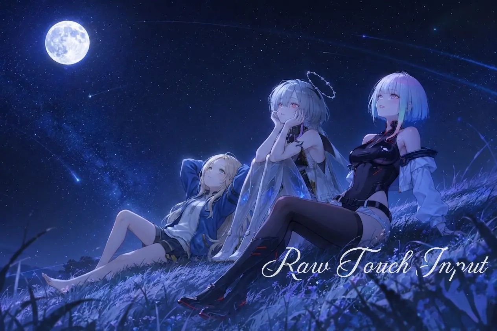

  

  
  
  

---

## 🚀 Overview

**RTI (Raw Touch Input) Universal** is an optimization module designed to drastically reduce touch-processing delay. By disabling IDC-level (Input Device Configuration) touch calibration and noise filtering, the module forces the system to process raw touch data directly. This results in a much faster, instantaneous, and highly accurate touch screen response—making it perfect for competitive gaming.

---

## ⚡ Core Features

* **Raw Input Processing:** Bypasses default system noise filters to provide untouched, raw input coordinates.
* **Reduced Touch Latency:** Noticeably decreases the delay between your finger touching the screen and the system registering the action.
* **Competitive Gaming Ready:** Enhances fast-paced swiping and multi-touch accuracy for games that demand pixel-perfect reflexes.
* **Universal Capability:** Works across various Android versions and devices. *(Note: The final effect depends heavily on your specific device's touch driver).*

---

## 📦 Installation

This is a **Magisk / KernelSU Module**, so you must install it via your preferred Root Manager (Magisk, KernelSU, or APatch).

1. Download the latest `.zip` from the [Releases](../../releases) page.
2. Flash it via your Root Manager.
3. Reboot your device and enjoy!

---

## 🤝 Contributing & Bug Reports

We welcome feedback and contributions to make **RTI** even better!

* **Report Bugs:** If you find any issues, please open an Issue on GitHub.
* **Suggestions:** Have an idea to improve the module? Feel free to contact the author or open a discussion.

---

## 👤 Credits & Acknowledgements

| Role | Developer |
| :--- | :--- |
| **Author** | [@kaminarich](https://t.me/kaminarich) |

---

## 📌 Stay Updated & Support

Get the latest news, updates, or support the development of this project by following our official channels! If you like this project, consider supporting the author.

  
  
  

*Feel free to report bugs, give suggestions, or drop a donation to support the project via Telegram!*
